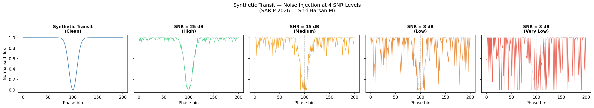
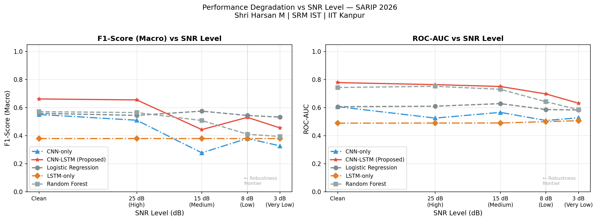
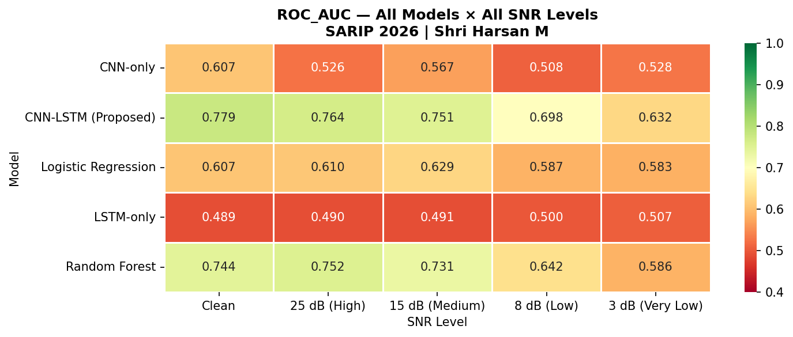
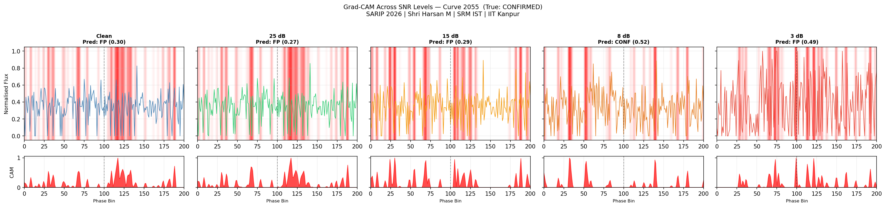
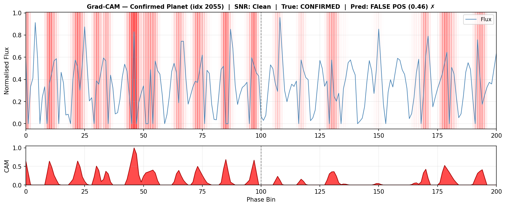

# Exoplanet Transit Detection — Robustness & Interpretability Study

<p align="center">
  
</p>

<p align="center">
  
  
  
  
  
</p>

---

## What Is This?

A study of whether a hybrid CNN–LSTM model is more robust and interpretable than single-architecture baselines for detecting exoplanet transits in degraded stellar light curves.

Most published models — including [ExoMiner](https://arxiv.org/abs/2111.10009) — are benchmarked on clean, pre-processed Kepler data. This project deliberately breaks that assumption by injecting synthetic noise at four levels and measuring exactly where each model breaks down.

**Two questions driving the work:**
1. **Robustness** — At what SNR level does each model's performance collapse?
2. **Interpretability** — When the model correctly identifies a planet, is it looking at the right part of the light curve?

---

## Results

### Performance Degradation vs SNR

<p align="center">
  
</p>

### ROC-AUC — All Models × All SNR Levels

| Model | Clean | 25 dB | 15 dB | 8 dB | 3 dB |
|---|---|---|---|---|---|
| **CNN–LSTM (this work)** | **0.779** | **0.764** | **0.751** | **0.698** | **0.632** |
| Random Forest | 0.744 | 0.752 | 0.731 | 0.642 | 0.586 |
| Logistic Regression | 0.607 | 0.610 | 0.629 | 0.587 | 0.583 |
| CNN-only | 0.607 | 0.526 | 0.567 | 0.509 | 0.528 |
| LSTM-only | 0.489 | 0.490 | 0.491 | 0.500 | 0.507 |

**CNN–LSTM achieves the highest ROC-AUC at every SNR level** and degrades the most gracefully.

<p align="center">
  
</p>

---

## Grad-CAM Interpretability

<p align="center">
  
</p>

Grad-CAM reveals that the model doesn't focus only on the transit dip — it reads **global light curve morphology**: periodicity, baseline stability, and variability patterns. This has direct implications for how astronomers should interpret deep learning classification decisions.

<p align="center">
  
</p>

---

## Model Architecture

```
Input (201 phase bins)
    │
    ├── Conv1D(64, kernel=3) → BatchNorm → MaxPool
    ├── Conv1D(128, kernel=3) → BatchNorm → MaxPool    ← Grad-CAM target layer
    ├── LSTM(128, return_sequences=True, dropout=0.3)
    ├── LSTM(64, dropout=0.3)
    ├── Dense(64, ReLU, L2)
    └── Dense(1, Sigmoid)

Loss: Focal Loss (γ=2.0, α=0.25)
```

**Ablation findings:**
- **LSTM-only** collapsed to majority-class prediction (F1 = 0.38 flat) — temporal modelling without spatial feature extraction does not work on noisy light curves
- **CNN-only** degrades sharply below 15 dB
- **CNN–LSTM** maintains the highest ranking ability across all noise conditions

---

## Dataset & Preprocessing

- **Source:** [NASA Kepler Objects of Interest Cumulative Table](https://exoplanetarchive.ipac.caltech.edu/)
- **Size:** ~6,916 phase-folded light curves — binary labels: CONFIRMED vs FALSE POSITIVE
- **Pipeline:** Normalize flux → Phase-fold on orbital period → Bin to 201 points → Random gap masking (10–15%)

### SNR Noise Framework

| Level | SNR | Simulates |
|---|---|---|
| High | 25 dB | Clean Kepler pipeline output |
| Medium | 15 dB | Moderate instrument noise |
| Low | 8 dB | Ground-based / early processing |
| Very Low | 3 dB | Severely degraded raw data |

---

## Repository Structure

```
├── src/
│   ├── preprocessing.py     # KOI download + phase-fold pipeline
│   ├── download_full.py     # Parallel Kepler downloader
│   ├── noise_injection.py   # SNR noise framework
│   ├── models.py            # All architectures + focal loss
│   ├── train.py             # Training loop
│   ├── evaluate.py          # Metrics + degradation curve plots
│   └── gradcam.py           # Grad-CAM interpretability
├── results/
│   ├── metrics/             # all_results.csv, summary_table.csv
│   └── gradcam/             # All visualisation outputs
├── environment.yml
└── requirements.txt
```

---

## Quickstart

```bash
git clone https://github.com/ShriHarsan64K/exoplanet-cnn-lstm-robustness.git
cd exoplanet-cnn-lstm-robustness
conda env create -f environment.yml && conda activate sarip

python src/preprocessing.py        # test run (50 curves)
python src/download_full.py        # full dataset (~6900 curves)
python src/noise_injection.py      # generate 4 SNR versions

python src/train.py --run baselines
for snr in clean snr_high snr_medium snr_low snr_very_low; do
    python src/train.py --model cnn_lstm --snr $snr
done

python src/evaluate.py --report --plot
python src/gradcam.py
```

---

## References

1. **Valizadegan et al. (2022)** — ExoMiner: A Highly Accurate and Explainable Deep Learning Classifier That Validates 301 New Exoplanets. *ApJ, 926, 120.* [arXiv:2111.10009](https://arxiv.org/abs/2111.10009)

2. **Shallue & Vanderburg (2018)** — Identifying Exoplanets with Deep Learning: A Five-Planet Resonant Chain around Kepler-80 and an Eighth Planet around Kepler-90. *AJ, 155, 94.* [DOI:10.3847/1538-3881/aa9e09](https://iopscience.iop.org/article/10.3847/1538-3881/aa9e09)

3. **Ansdell et al. (2018)** — Scientific Domain Knowledge Improves Exoplanet Transit Classification with Deep Learning. *ApJL.* [arXiv:1810.13434](https://arxiv.org/abs/1810.13434)

4. **Selvaraju et al. (2017)** — Grad-CAM: Visual Explanations from Deep Networks via Gradient-based Localization. *ICCV 2017.* [arXiv:1610.02391](https://arxiv.org/abs/1610.02391)

5. **Lin et al. (2017)** — Focal Loss for Dense Object Detection. *ICCV 2017.* [arXiv:1708.02002](https://arxiv.org/abs/1708.02002)

6. **Bassi et al. (2021)** — Classification of Variable Stars Light Curves Using Long Short Term Memory Network. *Frontiers in Astronomy and Space Sciences, 8.* [DOI:10.3389/fspas.2021.718139](https://doi.org/10.3389/fspas.2021.718139)

7. **Malik et al. (2021)** — Exoplanet Detection Using Machine Learning. *MNRAS.* [DOI:10.1093/mnras/stab3692](https://doi.org/10.1093/mnras/stab3692)

---

## Author

**Shri Harsan M** — M.Tech Data Science, SRM Institute of Science and Technology

[](https://linkedin.com/in/shriharsan)
[](https://github.com/ShriHarsan64K)
